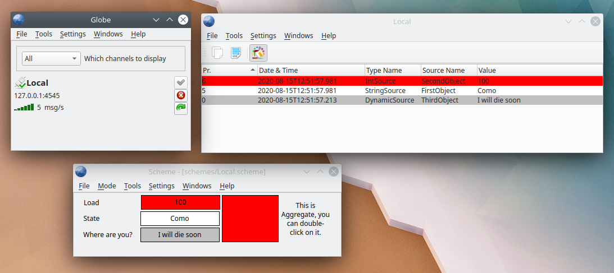
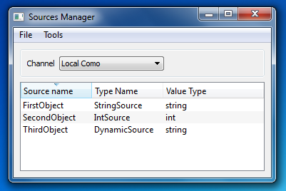
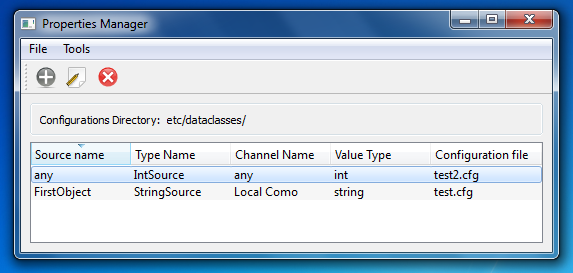
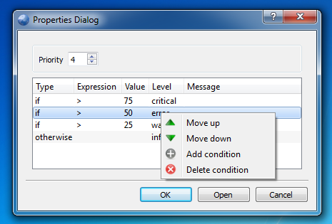
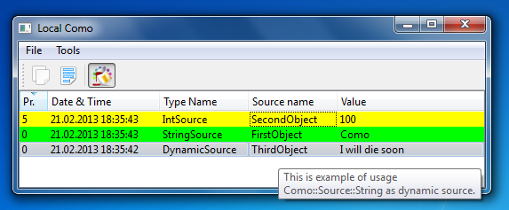
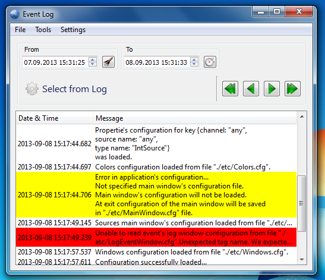
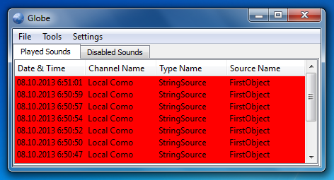
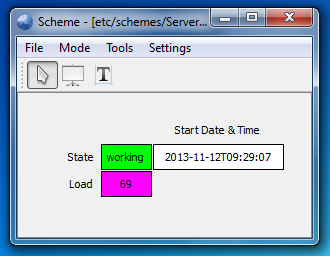

Globe is a tool (application) for viewing Como sources. About Como you can read
[here.]( https://github.com/igormironchik/components-observation )

The main idea of the application is that the user creates a channel in the Globe for viewing available Como sources in the application that provides such information through the given channel.



# Channels


To create channel user should click right mouse button in the main window to see context menu, where he can select "Add channel" action. At this point application will invoke dialog with channel's attributes, such as IP address, port and name. Name of the channel should be unique. The bundle of IP address and port should be unique too. If user will try to create channel with engaged channel's name or the bundle of IP address and port he will be notified about it in the dialog and dialog will not allow to create new channel while user will not fix errors.

When channel created it will be shown in the list of channels. User can connect to the application by pressing appropriate button on the channel widget in the list. Also user can disconnect or reconnect. For this there is appropriate buttons. There are name, IP address and port, current messages per second rate shown in the channel's widget. There is a subordinate widget to control timeout in the channel. By default timeout in the channel is 0 seconds. That means that all messages form channel will immediately shipped for the processing in the application. But user can change this behaviour by setting timeout to some value. He can do it with mouse by clicking and sliding on that widget. If timeout is more than 0 seconds then all received messages will be saved in internal buffer of the channel and only after timeout will be sent to the application. But if for some Como source channel will receive more than one message with value update then only last value will be sent to the application.

User can switch between shown channels mode in the main window. He can select "Disconnected" and all connected channels will disappear from the list. In the same way he can switch to show only connected channels and to show all available channels.

# Sources window



In the Globe, you can view all of the existing data sources, including the de-registered. Intended for this window "Sources window", access to which can be obtained from the menu "Tools". This window displays all of the existing data sources from the selected channel. In "Sources window" window via the context menu, you can edit the current data source properties and add new ones. Also from this window using the mechanism of "drag and drop" you can drag a data source to the scheme of data sources window (this window will be explained later).

# Properties manager



From the "Tools" menu, you can call the properties  manager window. This window displays all the properties of the data sources. The properties you can edit, delete, add new ones. All changes in the properties take effect immediately, there is no need to restart the application. Data source properties are of four types: properties on the data source, that is, these properties will be used for data sources with the exact match name, type name and the name of the channel, the properties on the data source, but any channel, the type of properties similar to the first for except that the name of the channel is neglected; properties for a specific type of data source of a particular channel, the type of property does not include the name of the data source, that is, all the data sources with the exact match type name and the name of the channels have these properties, and a fourth type of properties - this property for a specific type of data source, but from any channel. When adding new properties the user allows to select the type of properties. Properties can always be edited. You can do this in the properties manager window, and in the "Sources window".

# Properties



Data source properties is a set of conditions. The condition is a logical expression of the relationship and the value that should be compared to the current value of the data source. If the evaluation result is positive, the data source takes condition’s values. By the value refers to the level of importance of the event and message. The conditions are evaluated in order to describe them, from first to last. If neither condition corresponds to the current value of the data source, it checks the last condition "otherwise", if it is presented, and if it is, it will return the value of this special condition.

# Channel View



Channel View is a window that provides information about all sources in channel. To create Channel View you can use "File->New->Channel View" menu or context menu of the channel in the main window. If channel is not connected then Channel View will provide opporunity to connect the channel. Once Channel View window created it will receive information from the channel about all changes in the channel and will provide information about changes in the view. If for sources was set properties then Channel View will colorize row with source in the correspondence of the properties. Colorizing can be switched off, but by default it is switched on. Channel View provides instrumentation for selecting and copying information about sources into the system's clipboard, that information copied in CSV format.

# Event's log



The application keeps a log of events. Log is stored in the local database, which based on SQlite. User can at any time read event's log from menu "Tools->Event Log". In the event's log window user can specify time range for reading log and select records from the log. For the user's convenience there are buttons for settings time range from application's start time and to the current time. Event's log has three severity levels. It's error, warning and information messages. In the event's log window error and warning messages are highlighted in red and yellow colors. If user wish he can copy any records from event's log view to the clipboard and text will be formatted for better perception. Event's log displayed page by page. Size of the log's page is 30 records. If user selected more then one page of event's log then he can navigate through the event's log with special buttons. I hope that event's log will be very useful and convenient for users.

# Sounds



The application can play sounds for specific level if configured so. One hundred last played sounds shown in the "Sounds" tool window. User can disable any sound deems necessary. Disabling of sound produced at a certain time which user specifies in the dialog. If user decides that disabled sound should be played again he can eneble it in the "Sounds" tool window on the "Disabled Sounds" tab from context menu. The sounds are played according to the level. More importatnt sound (for example, critical sound) stops less important and playing themselves. Turn on or off sounds for a particular
level is performed in the configuration dialog.

# Sources Log


The application can store all information about changes in sources values in the database log. By default this function is disabled. User can enable it in settings dialog. Sources log stores data for the given period of time, for example for one day. In sources log tool window user can see changes in the values of sources for specified channel, source type and source name, or all data for specified period of time. Displayed data the user can select in the settings of the sources log tool window.

# Scheme



Scheme it's window with source and text items. Source item represent Como source from any channel in the application. Scheme is editable in the GUI. For editing necessary to enable editing mode, for this in the Scheme is "Mode" menu. When editing is enabled toolbar with editing tools will come in sight. Edit items is possible with mouse and context menu on the items. Editing mode it's very simple WYSIWYG editor. When editing finished it's necessary to switch to the View mode (from the "Mode" menu). And then Scheme will display any changes in the sources. Scheme is very usefull window type for seeing states of the monitored applications.

# Getting from Repository

After clone update submodules with the next command:

```
git submodule update --init --recursive
```

# Donate

[](https://github.com/igormironchik)
